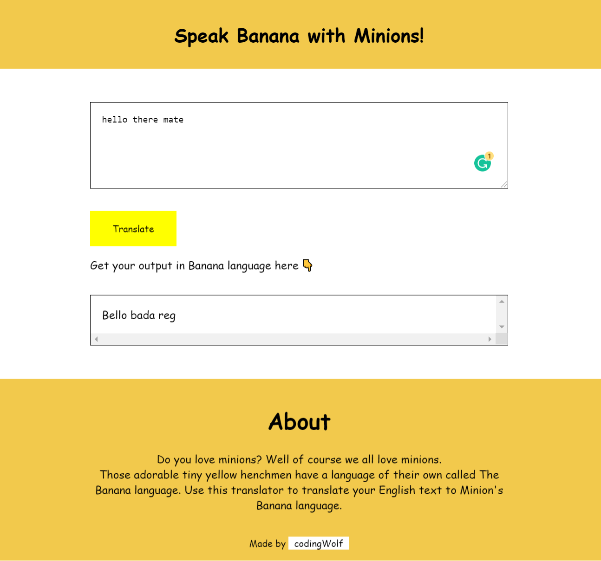

# The Banana Translator

A text translation app built while attending Neogcamp Web Dev Bootcamp. 

## Made using

- HTML
- CSS
- JavaScript

## API used

- Fun Translation - [Link](https://funtranslations.com/)